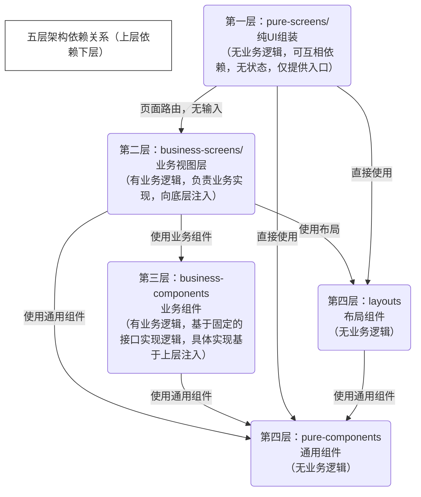

# 前端结构

pure-screens：纯UI组装，无业务逻辑。彼此存在单向依赖，和containers的区别在于是否存在业务逻辑
business-screens：有业务逻辑，有状态，彼此间无依赖。实现具体的业务/数据注入，遵守features提供的接口，实现具体功能。
business-components：有业务逻辑，有状态，彼此间无依赖。向上层暴露接口，等价于后端的service-interface
pure-components：无业务逻辑，无状态，提供通用组件
layouts：无业务逻辑，无状态，提供布局组件
screens-composables：业务逻辑代码，归属于business-screens，调用各种api，外部数据注入。
components-composables：业务逻辑代码，归属于business-components，不依赖api，根据约定的规范实现功能，类似于abstract。

# 图依赖

