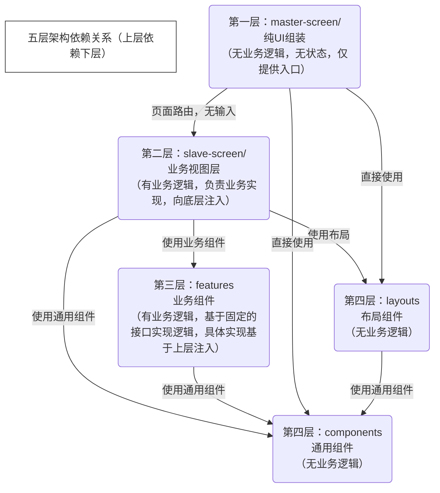

```mermaid
flowchart TB

title["五层架构依赖关系（上层依赖下层）"]

style title fill:#fff,stroke:#333

%% 定义层级

Layer1("第一层：master-screen/<br/>纯UI组装<br/>（无业务逻辑，无状态，仅提供入口）")

Layer2("第二层：slave-screen/<br/>业务视图层<br/>（有业务逻辑，负责业务实现，向底层注入）")

Layer3("第三层：features<br/>业务组件<br/>（有业务逻辑，基于固定的接口实现逻辑，具体实现基于上层注入）")

Layer4("第四层：components<br/>通用组件<br/>（无业务逻辑）")

Layer5("第四层：layouts<br/>布局组件<br/>（无业务逻辑）")

%% 依赖关系

Layer1 -->|页面路由，无输入| Layer2

Layer2 -->|使用业务组件| Layer3

Layer2 -->|使用通用组件| Layer4

Layer2 -->|使用布局| Layer5

Layer3 -->|使用通用组件| Layer4

Layer1 -->|直接使用| Layer4

Layer1 -->|直接使用| Layer5

Layer5-->|使用通用组件| Layer4

```
